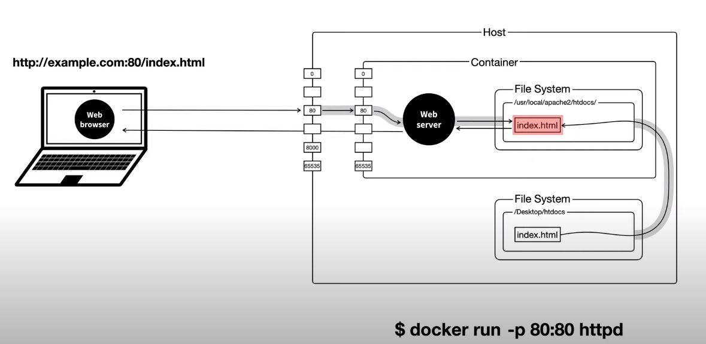
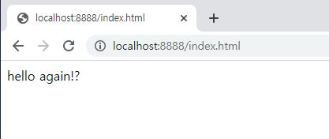

### 도커 컨테이너 안에 있는 파일 조작하기


도커를 이용해 웹서버를 띄웠다.  
그리고 이제 이 내용물을 다르게 바꿔보자.

```
docker exec ws3 {명령어}
```

도커에 올라가있는 컨테이너 ws3(사용자가 명명한 컨테이너 이름) 실행하면 컨테이너 내부를 파일 조회를 할 수 있다.


그런데 매번 컨테이너 안으로 들어가는 명령어를 치기 힘드니 아래와 같이 컨테이너 내부의 쉘을 유지시켜주는 명령어를 치면 # 모양이 뜨면서 이 뒤부터 내리는 명령은 ws3 컨테이너 내부 대상으로 내리는 실행 명령어가 된다.

```
docker exec -it ws3 /bin/sh
```

> 쉘 : 사용자가 입력한 명령를 쉘 프로그램이 받아서 그것을 운영체제에게 전달해주는 창구 역할을 한다


index.html 파일이 있는 경로로 이동을 한다.

```
# cd /usr/local/apache2/htdocs
```

apt 업데이트를 하고 html을 편집할 수 있는 nano라는 프로그램을 설치한 후 index.html을 열면 내용 수정이 가능하다.

```
# apt update
# apt install nano
# nano index.html
```


### 호스트 파일 시스템과 컨테이너 파일 시스템 연결

열심히 내용물을 수정한 파일이 도커 컨테이너에 반영이 되었다.  
하지만 개발자의 실수로 컨테이너를 날려버리면 열심히 수정한 노력이 물거품이 될 것이다... 그런 일을 미연에 방지하기 위해 파일 작업은 호스트 파일 시스템에서 하고 호스트에서 수정이 되면 컨테이너 파일 시스템에서 자동으로 반영이 되는 구조를 가져가는 편이 더 안전할 것이다.



1. 바탕화면에 htdocs 폴더 생성 후 index.html 파일을 생성한다.

```html
<html>
  <body>
    hello again!
  </body>
</html>
```

2. 터미널에서 호스트의 파일 경로:컨테이너 파일 경로 연결 후 컨테이너 실행

```
docker run -p 8888:80 -v C:\Users\{사용자폴더명}\Desktop\htdocs\:/usr/local/apache2/htdocs/ httpd
```



이 구조의 장점

- 나에게 익숙한 에디터로 파일 편집이 가능하다
- 버전 관리가 가능해진다

멀게만 느껴졌던 도커가 조금은 뚜렷하게 잡혀가는 느낌이다... 도커를 사용해 내가 만든 프로젝트를 커밋을 이용해 도커 허브에 올린다면 다른 사람이 그 이미지를 내려 받아 내가 설정한 환경 그대로 작업을 쉽게 이어갈 수 있을 것 같다.

### 도움 받은 자료들

- https://www.youtube.com/watch?v=Ps8HDIAyPD0&list=PLuHgQVnccGMDeMJsGq2O-55Ymtx0IdKWf
- https://www.youtube.com/watch?v=0kQC19w0gTI
