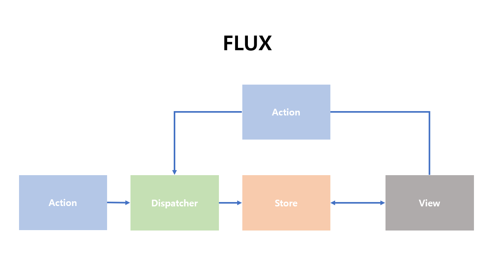

## 리액트 패키지 구조 (v16.12.0)

1. react 코어

   - react에서 사용되는 컴포넌트와 관련된 패키지
   - React element를 만드는 `createElement()`와 개발자에게 다른 패키지의 모듈을 제공하는 중간 다리 역할

2. renderer

   - 호스트와 react를 연결하는 역할을 하는 패키지
   - react-dom

3. reconciler

   - react 동작의 핵심 패키지
   - VDOM과 관련
   - v15 이전이 스택 기반이었다면 v16 이후부터는 `fiber 구조` 도입

4. scheduler

   - 리액트의 비동기 실행기

5. event
   - 개발자가 event를 사용하기 전 리액트에서 추가적인 제어를 하기 위해 호스트 event를 wrapping하여 작동된다

### 5.1 리액트 패키지 구동 순서

    (1) 컴포넌트 호출은 reconciler 패키지에서 한다.
    (2) 이후 VDOM이 전후 관계를 비교 후
    (3) rederer 패키지에서 실제 DOM에 마운트한다.

### 5.2 관련 용어 정리

- reactElement : 컴포넌트의 정보를 담은 객체로, 컴포넌트가 반환하는 것이 React Element이다.
- fiber : VDOM의 노드 객체로, 이 객체는 VDOM에서 React Element를 활용하기 위해 React Element를 확장시킨 객체이다.

  - fiber라는 객체를 통해 컴포넌트의 상태값, 훅 api, 리액트 라이프 사이클의 구현이 가능해진다.

### 5.3 VDOM

- VDOM은 fiber(=VDOM 노드)객체로 이루어져있다.
- 하나의 노드로 `현재 트리`와 `업데이트될 트리`를 관리한다.
- 돔이 실제로 마운트된 현재 트리와 VDOM에서 재조정 중인 업데이트 준비 트리로 나뉜다. 이 업데이트 준비 트리는 리액트 라이프사이클에서 `commit phase`라는 시점에 현재 트리로 관리된다.
- 업데이트될 트리는 현재 트리를 자기 복제해 참조하는 식으로 만들어진다.
- fiber(=VDOM 노드)구조는 자식을 child로 참조하는데 자식들 중 첫번째 자식만 참조한다.
  - 나머지 자식들은 첫번째 자식의 sibling 형태로 참조한다.

### 5.4 React Element

- jsx는 바벨을 통해 React Element라는 컴포넌트 정보를 담고 있는 객체로 변환된다.

### 5.5 Side Effect

- VDOM에 변경점을 만들어내는 작업
- 리액트에서 사용되는 side effect tag들이 존재
- fiber(=VDOM 노드)에 특정 태그가 붙으면 리액트 내부에서 effect로 취급돼 변경될 리스트의 상위에 위치한다.
- 부모 자식 컴포넌트 각각에 태그가 붙으면 자식 fiber 순서대로 리스트가 나열돼 리액트 라이프 사이클에서 `commit phase`라는 시점에 소비된다.

## 리액트 훅 동작 원리

### 6.1 리액트 훅 구현체

```js
// react > ReactCurrentDispatcher.js
const ReactCurrentDispatcher = {
  current: null,
}

export default ReactCurrentDispatcher
```

리액트 훅 구현체는 current 값만 갖고 있는 빈 객체이다. 이 빈 객체가 활용되기 위해서는
VDOM 역할을 하는 reconciler 패키지에서 훅이 주입되어야한다. 그런데 바로 주입되진 않고 shared 패키지라는 공통 폴더 역할을 하는 곳을 통로를 이용해 주입된다.

reconciler -> shared/ReactSharedInternal -> react/ReactSharedInternal -> react/ReactCurrentDispatcher -> react/ReactHooks -> react -> 개발자

### 6.2 리액트 훅 구현체 주입

```js
// reconciler > ReactFiberHooks.js
export function renderWithHooks(
  current: Fiber,
  workInProgress: Fiber,
  Component: any,
  props: any,
  refOrContext: any,
  nextRenderExpirationTime: ExpirationTime
) {
  /*...*/
  currentlyRenderingFiber = workInProgress // 현재 작업 중인 fiber를 전역으로 잡아둠
  nextCurrentHook = current !== null ? current.memoizedState : null

  ReactCurrentDispatcher.current =
    nextCurrentHook === null ? HooksDispatcherOnMount : HooksDispatcherOnUpdate

  let children = Component(props, refOrContext)

  /*컴포넌트 재호출 로직..*/

  const renderedWork = currentlyRenderingFiber
  renderedWork.memoizedState = firstWorkInProgressHook

  ReactCurrentDispatcher.current = ContextOnlyDispatcher

  currentlyRenderingFiber = null
  /*...*/
}
```

- 리액트 훅을 이용해 상태가 변경되어 컴포넌트가 호출되어야 할 때 훅리스트가 생성된다. 훅리스트라는 변수는 fiber(=VDOM 노드)에 memoizedState로 저장되어 훅이 컴포넌트와 매핑되도록 해 준다.
- fiber(=VDOM 노드)에 memoizedState가 null인 경우 마운트 상태가 아니고, null이 아닌 경우 마운트 상태로 확인해 그에 맞게 훅 구현체에 변경된 상태 정보가 주입된다.

### 6.3 리액트 훅은 어떻게 생성되는가

- 훅 구현체에는 마운트용 구현체와 업데이트용 구현체가 존재한다.
- 처음 컴포넌트가 마운트될 때 실행되는 훅의 경우 마운트 구현체로 객체가 생성이 된다.
- 하나의 컴포넌트에서 훅을 이용해 여러개의 상태 변경이 일어난 경우 업데이트 객체로 생성이 되어 훅의 큐에 저장된다.
- 이후 컴포넌트가 리-랜더링이될 때 큐에 저장되어있던 훅 객체들이 차례로 실행돼 최종 상태값들을 만든다.

### 6.4 리액트 훅은 어떻게 상태를 변경하고 컴포넌트를 리랜더링하는가

reconciler 패키지에 존재하는 **dispatchAction 함수를 이용해 훅 상태를 업데이트한다**

1. 업데이트된 정보가 담긴 훅 객체 생성
2. 훅 객체를 훅 큐에 저장
3. 불필요한 렌더링 최적화
4. 컴포넌트 변경을 돔에 적용하는 작업을 스케줄링한다
   - 작업 스케쥴링이 진행될 때 해당 fiber(=VDOM 노드)에 expirationTime이 새겨진다. (중복 스케줄링 방지)

- dispatchAction 함수는 컴포넌트를 재호출하는 작업을 딱 한 번만 스케줄한다. 최종 상태 정보들이 훅 객체에 저장되었다가 `render phase`에서 한 번에 소비된다.
- 컴포넌트 재호출 시점에 추가로 발생한 setState는 이전과 묶여서 1번으로 실행된다.

## 리액트를 왜 사용하나요

1. 컴포넌트 기반의 화면 구성  
   리액트는 화면의 한 부분을 `컴포넌트 단위로 나뉘어 관리`할 수 있다. 이런 특징은 기능에 따라 코드를 나눠 개발하기 편하고 반복되는 부분을 재사용할 수 있게 해 준다.
2. SPA 개발 가능  
   `화면의 필요한 부분만 업데이트`되어 `더 좋은 사용자 경험`을 가능하게 해 주고 `렌더링에서 좋은 효율`을 가진다.
3. 넓은 생태계  
   개발에 필요한 다양한 라이브러리가 리액트로 활용되어있어 웹 개발하기 수월하다.

## Virtual Dom에 대해서 아나요

DOM은 html문서에 접근하기 위한 인터페이스이다. DOM은 프로그래밍 언어가 문서에 접근할 수 있는 방법을 제공해 구조를 변경하고 스타일을 적용할 수 있게 한다.
리액트는 돔에 직접 접근하지 않고 가상돔이라는 DOM의 사본을 만들어 실제 돔을 변경한다.  
전체 ui를 가상돔에 리렌더링하고, 이전 내용과 현재 내용을 비교해 바뀐 부분만 실제 돔에 적용한다.  
가상돔을 사용한다고 해서 돔 업데이트가 무조건 빠른 건 아니지만 UI의 업데이트 처리가 간결하다는 장점이 있다.

- VDOM은 fiber(=VDOM 노드)객체로 이루어져있다.
- 하나의 노드로 `현재 트리`와 `업데이트될 트리`를 관리한다.
- 돔이 실제로 마운트된 현재 트리와 VDOM에서 재조정 중인 업데이트 준비 트리로 나뉜다. 이 업데이트 준비 트리는 리액트 라이프사이클에서 `commit phase`라는 시점에 현재 트리로 관리된다.
- 업데이트될 트리는 현재 트리를 자기 복제해 참조하는 식으로 만들어진다.
- fiber(=VDOM 노드)구조는 자식을 child로 참조하는데 자식들 중 첫번째 자식만 참조한다.
  - 나머지 자식들은 첫번째 자식의 sibling 형태로 참조한다.

## (다시) setState의 경우 동기로 동작하나요 비동기로 동작하나요?

비동기로 동작하는 훅 함수이다.
하나의 컴포넌트에서 훅을 이용해 여러개의 상태 변경이 일어났을 때 훅 객체들이 훅 큐에 저장된다.  
이후 컴포넌트가 리-렌더링이 될 때 큐에 있던 훅 객체들이 차례로 실행돼 최종 상태값을 만든다.

## (다시) setState가 비동기 동작을 취했을 때 얻을 수 있는 이점은 무엇인가요

setState가 비동기 동작을 하기 때문에 변경된 값들을 모아 한번에 업데이트가 가능해 렌더링 횟수를 줄일 수 있다.

## useMemo와 useCallback의 차이가 뭔가요

둘다 기존에 수행한 연산 값을 메모리에 저장해놓고 필요할 때 재활용하는 함수들이지만,  
useMemo는 기억된 값을, useCallback은 기억된 함수를 반환한다.

## 리덕스의 기본 원칙은

리덕스는 상태관리 라이브러리이다. store라는 변수를 이용해 전역에 두고 싶은 상태들을 저장한다.
리덕스의 기본 원칙은

1. 리듀서와 같은 순수함수에 의해 변경되어야 한다
2. 상태들은 읽기 전용이어야 한다
3. 전역으로 관리될 상태들은 하나의 저장소 안에 객체 트리 형태로 저장되어야한다

## 리덕스를 사용하신다고 하셨는데, Flux 패턴에 대해서 알고 있나요


Flux는 단방향 데이터 흐름을 강조하는 패턴이다.  
사용자의 행위라는 액션을 디스패처가 통제하고 디스패처가 스토어를 업데이트하면 변경된 스토어를 기준으로 뷰가 업데이트된다.

**MVC패턴**

> 액션이 일어나 컨트롤러를 통해 모델이 변화하고 이 변화가 뷰에 반영

## 리듀서 내부에서 불변성을 지키는 이유는? 전개 연산자의 단점을 해결할 수 있는 방법

리듀서는 현재 상태와 액션 객체를 받아서 새로운 상태를 반환해 주는 함수이다.  
`변경 전과 변경 후의 상태를 비교해 히스토리를 관리`하기 위해서 불변성을 지켜야합니다.

## 리듀서 내부에서 불변성을 유지하기 위해 얕은 복사를 사용하나요 깊은 복사를 사용하나요

리듀서가 불변성을 지키기 위해 객체를 복사할 때 `스프레드 연산자를 활용하는 경우 얕은 복사`가 일어난다.
객체의 깊이가 깊어 `코드가 길어지는 경우 간결하기 위해 immer와 같은 라이브러리를 활용`하는 걸로 알고 있다.

> 얕은 복사 : 객체의 주소값을 복사
> 깊은 복사 : 객체의 실제 값을 복사

## 본인이 생각하는 리덕스 thunk 와 saga의 차이가 뭔가요

리덕스 썽크는 리덕스에서 비동기 작업을 처리할 때 사용하는 미들웨어로 액션 객체가 아닌 `함수를 디스패치할 수 있다`.
리덕스 사가는 액션을 모니터링하고 있다가 `특정 액션이 발생했을 때 미리 정해둔 로직이 이루어지는 액션 리스너`이다.

## 리덕스 vs 리덕스toolkit 차이

기존의 리덕스를 사용하기위해 액션, 액션타입, 액션별 리듀서를 각각 정의해야했다면  
리덕스 툴킷은 `createSlice` 함수를 이용해 액션과 리듀서를 한번에 정의할 수 있다.
설치해야할 패키지 수가 줄고 설정이 간단하고 전반적인 코드량이 줄어 현업에서 상태관리도구로 선택해 사용 중이다.

## (더) react 18 신기능 알아보기

`userId`
고유한 id를 생성해 주는 훅이다. 고유한 값을 갖는 컴포넌트를 표현할 때 유용하다.

`startTransition`, `useTransition`
상태 업데이트의 우선순위를 나눠줄 수 있는 훅이다. 디바운싱이나 쓰로틀링 효과를 가져갈 수 있다.

> 디바운싱 : 연이어 호출되는 함수들 중 가장 마지막 함수만 호출하는 것
> 쓰로틀링 : 함수를 일정 간격으로 한번만 호출시키는 것

`useDeferredValue`
급하지 않은 부분의 렌더링을 지연할 수 있는 훅이다.
useTransition는 코드에 접근이 가능한데 우선순위를 낮춰야하는 경우에 사용하고  
useDeferredValue는 어떤 이유로 코드 접근이 불가능한데 상태 변경의 우선순위를 낮춰야할 때 사용한다.

`useSyncExternalStore`  
스토어에 대한 업데이트를 강제로 동기화 하여 외부 스토어가 concurrent read를 지원할 수 있도록 하는 새로운 훅이다.  
concurrent 렌더링이 등장하면서 렌더링이 렌더링을 잠시 중지할 수 있게 되면서 발생하는 tearing(시각적 비일치) 현상을 방지하기 위해 나왔다.

https://velog.io/@jay/useSyncExternalStore
https://yceffort.kr/2022/04/react-18-changelog

## react-query 준비

## 리액트 사용시에 부수효과로 인해 생기는 문제점이 있다면

## 컴포넌트의 라이프 사이클 메서드

## SPA가 뭔가요?🔥

- SPA의 단점

## SSR이 뭔가요

## SEO가 뭔가요
