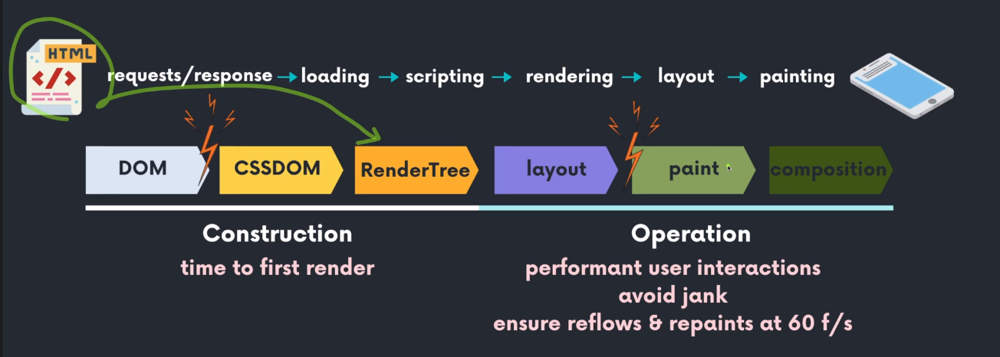

## oop

- 객체를 나누는 단위는?
- 어플리케이션 의존성을 낮추는 방법은?

## CPU, GPU, 프로세스, 쓰레드

CPU: 컴퓨터의 두뇌로, 여러종류의 작업을 하나씩 처리
GPU: 그래픽처리장치로, 그래픽작업을 처리하며 동시에 작업 수행 가능
프로세스: 어플리케이션이 실행되는 프로그램
쓰레드: 프로세스 내부에 있는 프로그램의 일부

> 브라우저 탭마다 하나의 렌더러 프로세스를 갖는다.
> 렌더러 프로세스의 메인 스레드가 브라우저로 전송된 대부분의 코드를 처리한다.
> 또한 렌더러 프로세스에는 웹 페이지를 부드럽게 렌더링하기 위해 컴포지터 스레드와 래스터 스레드가 실행된다

## 브라우저 렌더링

페이지 주소창의 url을 입력하면 렌더러 프로세스가 받아 html 데이터를 수신하고, 메인 스레드가 html을 파싱해 돔으로 변환하기 시작한다.
html 파싱을 하는 동안 이미지, css, js 같은 외부 리소스를 만나면 메인 스레드가 네트워크 요청을 하는데, html 파싱 속도를 높이기 위해서 프리로드스캐너도 동시에 실행한다. 프리로드스캐너가 먼저 리소스를 찾기 위해 html에서 파싱된 토큰값을 이용해 네트워크 요청을 한다.
웹페이지의 모양을 만들기 위해 메인 스레드는 css 파싱을 하고 각각의 돔 노드에 계산된 스타일을 지정한다.
**레이아웃:** 메인 스레드는 돔과 계산된 스타일을 훑어가면서 레이아웃 트리를 만드는데 이때 보이는 요소만 만들기 때문에 display:none 속성을 갖는 노드는 레이아웃 트리에 포함되지 않는다.
**페인트:** 메인 스레드는 어떤 순서로 화면에 그려줄지 결정하는 페인트 과정을 거친다.
**컴포짓:** 그려줄 순서가 끝나면 픽셀로 변환하는 레스터화 과정을 하는데 이때 화면 부분별로 레이어가 생성된다.
컴포지터 스레드라는 별도의 스레드에서 레이어를 합성하면 브라우저 화면이 완성된다.

> rel=preload
> https://d2.naver.com/helloworld/5237120

> 정리
> 생성된 돔 요소에 변경이 생겨 레이아웃트리를 다시 만들어야하는 경우를 리플로우라한다.
> 리플로우가 발생했거나 배경색 변경과 같은 단순 스타일 변경의 경우 리페인트가 일어난다.

## 이벤트 루프란? 🔥🔥🔥

브라우저의 `메인 스레드 동작 타이밍을 관리`하는 관리자이다.

> 메인 스레드? 자바스크립트 코드 실행이나 브라우저 렌더링과 같은 주된 동작이 수행되는 곳

**이벤트 루프 동작 방식**
이벤트 루프는 콜스택에 쌓여있는 코드들을 처리한다. 이때 Promise(마이크로)나 setTimeout(매크로) 같은 비동기 코드를 만나면 태스크큐에 등록한다.  
처음 콜스택에 있는 코드들이 모두 실행되면 마이크로태스크큐가 우선순위를 갖고 실행된다. 이 마이크로태스크큐는 큐 안에 있는 태스크가 전부 소비가 되어야 이벤트 루프가 다음 작업을 진행할 수 있다.
이후에 만일 화면을 업데이트해야할 일이 발생하면 이벤트루프는 렌더큐를 소비한다.
화면 갱신이 끝나면 일반 태스크큐에 있는 콜백을 하나씩 실행한다.

## 비동기

### 동기와 비동기의 차이점에 대해서 설명해줄 수 있나요? 🔥🔥

동기 : 현재 실행 중인 작업이 종료되지 않는다면 다음 작업을 대기하는 방식  
비동기 : 현재 실행 중인 작업이 종료되지 않더라도 다음 작업을 실행하는 방식

ex. setTimeout, setInterval, http 요청, 이벤트 핸들러

### 동시에 여러개의 관계없는 요청을 한다면?

### 마이크로태스크 큐에 대해서 알고 있나요? 🔥🔥

태스크큐는 마이크로태스크큐와 매크로태스크큐로 나뉜다.
브라우저 api에 따라 마이크로태스크큐 혹은 매크로태스크큐를 사용한다.

- 마이크로태스크큐: Promises
- 매크로태스크큐: requestAnimationFrame, setTimeout, setInterval

### 태스크 큐와 마이크로태스크 큐 중 어떤 것이 먼저 실행되나요? (이벤트루프 동작 방식) 🔥🔥

마이크로태스크큐가 태스크큐에 비해 우선순위가 높다.

## Ajax

### Ajax를 사용하면 기존 방식과 어떤 차이가 있을까요?

### JSON 이 뭔가요?

### JSON이 제공하는 정적 프로토타입 메서드에 대해 몇가지 말해볼 수 있나요?

JSON.stringfy
JSON.parse

### Ajax로 HTTP 요청을 보내기 위해서는 어떤 방법을 사용할 수 있나요?

### XMLHttpRequest와 fetch 메서드의 차이는 무엇이라고 생각하시나요?

## 쿠키와 세션은 어떤 차이? 🔥🔥

사용자 정보가 `저장되는 위치에 차이`가 있다.  
쿠키는 서버의 자원을 사용하지 않지만 세션은 서버에서의 처리가 필요하다.
세션은 서버 처리가 필요해서 속도면에선 쿠키가 더 빠르지만 보안면에선 세션이 더 우수하다.
`라이프사이클`: 쿠키는 브라우저가 종료되어도 유지할 수 있지만 세션은 브라우저가 종료되면 세션 정보도 삭제된다.

- 보안면에서 더 우수한 이유는 세션 방식은 쿠키를 이용해서 식별할 id값만 브라우저에 저장하기 때문이다.

**쿠키?**
브라우저에 키밸류 형태로 저장되는 작은 데이터 파일이다.
쿠키는 사용자가 따로 요청하지 않아도 브라우저가 서버로 요청할 때 요청 헤더에 추가해서 서버로 넘겨준다.

**세션?**
쿠키 기반이지만 사용자 정보를 브라우저가 아닌 서버에서 관리한다.

> csrf 토큰?
> 서버에서 내려준 토큰이 자기가 줬던 값인지 확인하기 위한 토큰
> 제 3자가 화면을 가로채 위조해도 서버로 내용을 보낼 땐 토큰이 달라 공격 방어가 된다

> x-csrf 토큰?
> csrf 토큰의 약점을 보완하기 위해 만들어진 토큰
> 서버에서 토큰을 내려주면 클라이언트가 html 태그 어딘가에 해당 토큰을 보관해야한다
> html 태그에 보관하는 방식이 아닌, 매 요청마다 헤더에 서버가 줬던 토큰을 자동 저장시켜 요청을 보내게 한다

> jwt 토큰?
> 서명된 토큰을 이용해 클라이언트와 서버가 요청 및 응답을 한다

최근 사업은 `x-csrf 토큰 인증 방식을 이용해` 서버와의 요청응답이 이루어진다.

세션과 쿠키 인증 방식이라서 브라우저에 세션 id와 csrf 토큰이 쿠키로 저장이 되지만,

데이터 변경과 관련된 (POST, PUT, DELETE Method) 공격을 방어하기 위해,
csrf 쿠키의 samesite 설정을 lax로 해서 get 요청 외에는 서버 요청에 쿠키를 삽입하지 않았다.

대신 데이터 변경과 관련된 요청은 세션 id를 통해 인증된 내 요청의 csrf 토큰값을 가져와 요청했다. sessionid는 브라우저의 쿠키로 저장되어있지만 httponly 설정을 해두면 자바스크립트에서 접근이 불가능해 이 방식을 채택했다.

\*\*!웹 브라우저는 서버 요청에 쿠키를 삽입할지를 samesite 쿠키 설정을 보고 판단한다.

## JWT 로그인 vs 세선 로그인

동시 접속 로그인을 막아야하거나 서버 자원에 여유가 있는 사업성 프로젝트의 경우 세션쿠키 방식을 사용하고

서버 자원이 넉넉하지 않거나 고객사 납품용 프로젝트가 아닌 경우 jwt 로그인 방식으로 구현 중이다.

jwt토큰을 탈취당했을때를 대비해 accesstoken, refreshtoken 방식으로 구현되었다.

> at토큰의 유효기간을 짧게해 탈취당해도 refreshtoken으로 재발급 받을 수 있도록 하기 위함이다
> 토큰을 브라우저 로컬스토리지에 저장하면 xss 공격에 취약하고 쿠키에 저장하면 csrf 공격에 취약해지므로 x-csrf 방식을 도입했다

## Promise, async 🔥🔥

Promise는 자바스크립트에서 비동기 처리가 가능하도록 하는 객체이다.
펜딩, 풀필, 리젝트 상태를 갖고있고 풀필 상태면 resolve를 호출하고 리젝트 상태면 reject를 호출한다. resolve된 값은 then 함수를 이용해 받을 수 있고 reject된 값은 catch 함수를 이용해 받을 수 있다.

async await 함수는 es6 문법에서 나온 비동기 처리 함수이다.
promise의 콜백 가독성을 개선할 수 있다.

이 둘의 차이로는 에러 핸들링에 있는데 promise를 사용하면 catch문을 통해 에러를 반환받을 수 있지만 async await은 핸들링 기능이 따로 없어 try catch 문을 활용해야 한다.

## 컴파일러는 뭐고 인터프리터는 뭔가요?
