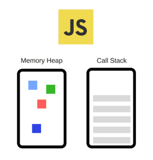
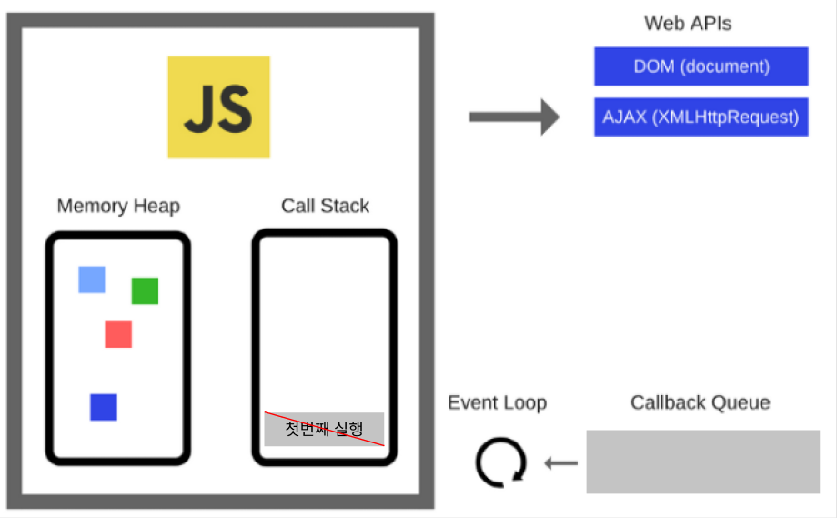
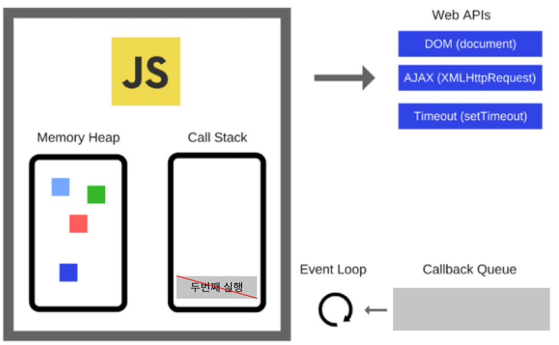
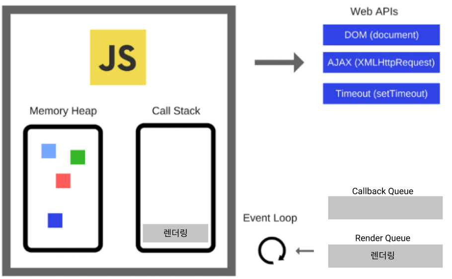

자바스크립트의 작동 원리에 대해 조금 더 깊은 학습이 필요하다 생각되어 글로 정리해 보았다.

> 자바스크립트는 싱글스레드로 동작하는 언어

❓ **싱글 스레드**  
단어 그대로 한 번에 하나의 작업만 수행할 수 있다는 의미이다. 카페를 예로 들자면 카페에 바리스타가 단 한 명이라 그 한 명으로 주문을 받을 수 있고 그 한 명으로 커피를 만들 수 있다. 주문을 받는 동안 커피를 만들 수 없고, 커피를 만드는 동안 주문을 받을 수 없다.

그렇다면 자바스크립트 코드로 비동기 코드를 짜는 건 어떻게 가능한 일이었을까?

### 자바스크립트 동작 방식



❓ **메모리힙이란**  
메모리를 할당하는 영역을 의미

❓ **콜스택이란**  
코드가 호출되면서 스택으로 쌓이는 영역을 의미

```js{numberLines: true}
const 첫번째함수 = (x, y) => {
  return console.log(x + y)
}
const 두번째함수 = (a, b) => {
  첫번째함수(a, b)
}

두번째함수(1, 2) // 실행 시작
```

위와 같은 코드가 있다고 가정했을 때 콜스택에서 이루어지는 호출 방식은 아래와 같다.


먼저 들어간 것이 나중에 빠져나오는 방식으로, 순서의 끝부분부터 실행이 된다.

그럼 `setTimeout` 과 같이 몇 초 뒤에 실행이 되는 비동기 코드는 콜스택에서 어떤 식으로 호출이 되는 걸까? 🤔

### 비동기는 웹 API 환경에서 이루어진다

❓ **웹 API란**  
브라우저에서 자체 지원하는 API이다. 웹 API는 Dom 이벤트, Ajax (XmlHttpRequest), setTimeout 등의 비동기 작업들을 수행할 수 있도록 API로 기능을 지원한다.

```js{numberLines: true}
console.log("첫번째 실행")
setTimeout(() => console.log("세번째 실행"), 1000)
console.log("두번째 실행")
```

위 코드의 실행 방식은 아래와 같은 그림처럼 진행이 됩니다.



1. 첫번째 실행이라는 콘솔이 콜스택에 쌓이고 바로 실행되어 콜스택에서 제거된다.


2. 그런 다음 setTimeout 코드가 콜스택에 쌓인다.
3. **자바스크립트의 엔진이 비동기 작업을 웹 API에게 위임한다.**



4. 두번째 실행이라는 콘솔이 콜스택에 쌓이고 바로 실행되어 콜스택에서 제거된다.


5. 웹 API에서 생성된 타이머가 생성된 시점을 기준으로 1초 뒤에 콜백큐로 콜백함수를 전달한다.
6. 이벤트루프는 콜스택이 비어 있는 걸 확인 후, 콜백큐에 대기 중인 콜백함수(setTimeout)를 콜스택에 넘겨준다.  
   ❓ **콜백큐란**  
   웹 API에서 비동기 작업들이 실행된 후 호출되는 콜백 함수들을 기다리는 공간이다. 이벤트 루프가 정해준 순서대로 줄 서있고 선입선출 방식을 따른다.
   또한 콜백큐는 하나의 큐로 이루어져있지 않고 여러개의 큐로 이루어져있다. (쉬운 도식화 그림을 만들기 위해 하나로 퉁친 것)  
   ❓ **이벤트 루프란**  
   이벤트가 발생 시 호출되는 콜백 함수들을 관리해서 콜백큐에 전달하고, 콜백큐에 담겨있는 콜백 함수들을 콜스택에 넘겨준다.
7. setTimeout이 콜스택에서 실행 후 제거됩니다.

> 자바스크립트는 비동기 작업들을 웹 API에게 넘겨줌으로써, 해당 작업이 완료될 때까지 다른 코드를 실행할 수 있도록 한다.

만약 http 요청과 같은 작업을 동기로 수행하여 콜스택에서만 모든 작업이 이루어진다면 사용자는 http 요청이 끝날 때까지 화면에서 어떤 작업도 수행할 수 없다. 🙄  
하지만 자바스크립트가 비동기 작업이 필요한 (시간이 오래 걸리는) 작업들을 웹 API에게 위임한 덕분에 다른 코드들이 실행이 되고, 이 과정에서 동시성을 갖게 되는 것이다.

**즉, 동시성을 가능하게 해 주는 비동기 작업들은 자바스크립트 엔진을 구동하는 런타임 환경(웹 API)에서 담당을 한다. 그리고 여기서 말하는 런타임 환경은 브라우저 혹은 Node.js를 말한다.**

### 2가지 콜백

자바스크립트의 싱글스레드 방식을 보완하는 방법으로 웹 API를 이용한 비동기 방식을 채택한 것은 이해했다. 그런데 단순히 비동기를 시켜주는 것만으로 웹에서 일어날 수 있는 블로킹(화면 멈춤 현상)을 완화시킨다는 개념이 잘 닿지 않아 검색을 더 해 보았고, **렌더큐** 라는 것이 있다는 걸 알게 되었다.

콜백 함수는 2가지로 나누어볼 수 있습니다.

1. 함수가 호출하는 다른 콜백 함수
2. 비동기적으로 호출되는 콜백 함수

```js{numberLines: true}
// 1. Synchronous (동기)
;[1, 2, 3, 4].forEach(function (i) {
  console.log(i)
})

// 2. Asynchronous (비동기)
function asyncForEach(array, cb) {
  array.forEach(function () {
    setTimeout(cb, 0)
  })
}
asyncForEach([1, 2, 3, 4], function (i) {
  console.log(i)
})
```

1번과 2번 코드는 둘다 forEach라는 함수를 사용하지만 1번의 경우는 콜스택에 쌓이는 방식이고 2번의 경우는 웹 API를 활용해 콜백큐로 이동했다가 이벤트 루프를 통해 콜스택으로 호출되는 방식이다.

#### 비동기 콜백을 이용해 블로킹 완화시키기

1번 코드와 같은 기본적인 콜백 방식의 문제점은 웹 브라우저의 렌더링을 못하게 하여 UI를 블로킹시키는데 있다고 합니다. 웹 브라우저는 1초에 60 프레임을 그리는 게 가장 이상적인데, 렌더링 또한 콜백처럼 작용을 해서 콜스택에 들어가게 된다.  
즉, 콜스택에서 불필요하게 많은 작업이 쌓인다면 렌더링 또한 지연될 수 있다는 것을 의미한다.

이런 문제를 해결해 볼 수 있는 것이 렌더큐이다.



이벤트 루프가 콜백큐를 감시하는 것과 비슷한 방식으로 콜스택이 비었을 때 렌더큐가 렌더링을 시도한다. 위와 같은 forEach 함수를 비동기 콜백으로 작업을 실행하면 콜스택이 비는 때가 존재하기 때문에 브라우저가 렌더링이 될 수 있는 틈을 주게 되는 효과를 가져갈 수 있습니다.

### 마무리

콜스택, 콜백큐, 웹API, 자바스크립트의 비동기에 대한 모호한 개념이 어느 정도 풀린 것 같다. 자바스크립트 자체에서 비동기를 지원하는 것이 아니라 자바스크립트를 실행시키는 런타임 환경인 브라우저가 존재하기에 비동기라는 동시성을 가질 수 있었던 거고, 브라우저에서 제공하는 웹 API를 이용한 콜백이 함수가 호출하는 콜백과 어떻게 다른지 콜스택과 렌더큐를 이용해 이해하게 되었다.  
웹 API를 이해하고 활용해 브라우저가 효율적으로 렌더링할 수 있는 코드를 짜도록 노력해야될 것 같다.

### 도움 받은 자료들

- https://www.youtube.com/watch?v=8aGhZQkoFbQ&feature=youtu.be
- https://baeharam.github.io/posts/javascript/jshow-javascript-works/
- https://medium.com/@vdongbin/javascript-%EC%9E%91%EB%8F%99%EC%9B%90%EB%A6%AC-single-thread-event-loop-asynchronous-e47e07b24d1c
